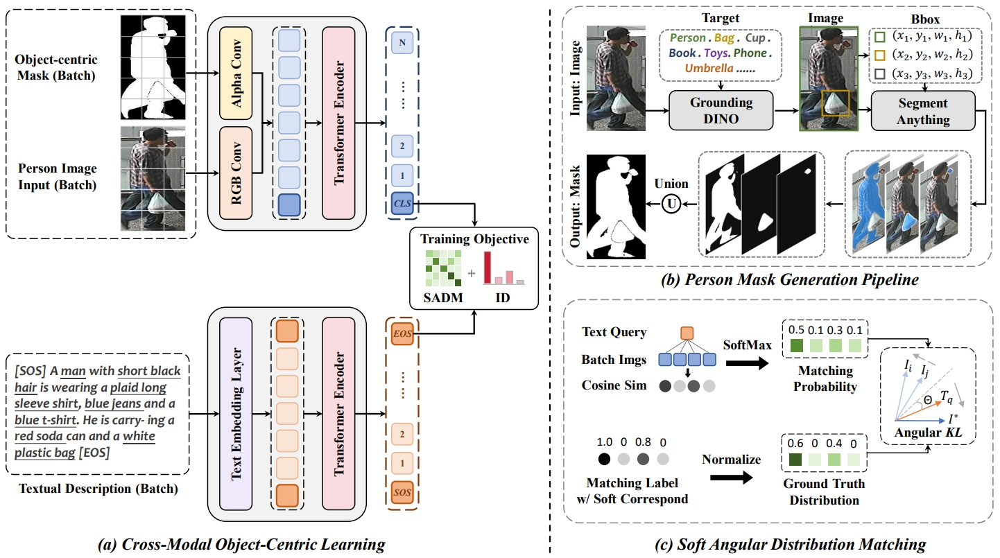

# Object-Centric Discriminative Learning for Text-Based Person Retrieval (OCDL)
Pytorch implementation of the ICASSP 2025 paper "Object-Centric Discriminative Learning for Text-Based Person Retrieval" [Paper](https://ieeexplore.ieee.org/document/10887901)

## Highlights
We propose a novel framework for text-based person retrieval, Object-Centric Discriminative Learning (OCDL), which incorporates person masks to indicate attentive regions, thereby enhancing the model’s focus on the pedestrians in images while suppressing the background noise. Additionally, a novel cross-modal matching loss, namely Soft Angular Distribution Matching (SADM), is introduced to learn discriminative visual and textual representations. Experiments on three widely-used TBPR benchmarks demonstrate the effectiveness of our approach.




## Usage
### Requirements
We use a single NVIDIA A100 GPU for training and evaluation.
```
conda create -n ocdl_reid python=3.8
conda activate ocdl_reid
pip install torch==1.10.0+cu113 torchvision==0.11.0+cu113 -f https://download.pytorch.org/whl/torch_stable.html
pip install -r requirements.txt

cd AlphaCLIP
pip install -e .
```
### Prepare Datasets
We have uploaded the dataset to [Google Drive](https://drive.google.com/file/d/1X7rmw0TmDjqa0b69qCn_EGSK3KCC-8zs/view?usp=drive_link), which includes the original CUHK-PEDES, ICFG-PEDES, and RSTPReid data, as well as additional person masks data (saved under the path `...alphas/`).
Note that we have not open-sourced the code for generating person masks, as it is quite simple and many open-source projects today can even produce better masks. If you're very interested, you can refer to [Grounded-Segment-Anything](https://github.com/IDEA-Research/Grounded-Segment-Anything) as the basis for generation.

Unzip and organize them in your dataset root dir folder as follows:
```
|-- YOUR_DATA_ROOT
   |-- CUHK-PEDES
       |-- imgs
            |-- cam_a
            |-- cam_b
            |-- ...
       |-- alphas
            |-- cam_a
            |-- cam_b
            |-- ...
       |-- reid_raw.json
       
   |-- ICFG-PEDES
       |-- imgs
            |-- test
            |-- train
       |-- alphas
            |-- test
            |-- train
       |-- ICFG_PEDES.json

   |-- RSTPReid
       |-- imgs
       |-- alphas
       |-- data_captions.json
```

### Pretrained Weights
Download the model weights according to the provided link and place the downloaded files into the `pretrain/` directory (e.g. `pretrain/clip_b16_grit+mim_fultune_4xe.pth`), or specify the weights directory using the `--alpha_ckpt` parameter. Note that you can select the architecture by specifying `--pretrain_choice` (e.g. `--pretrain_choice ViT-B/16` for AlphaCLIP-B/16)

|   model   |                      google drive link                       |                        openxlab link                         |
| :-------: | :----------------------------------------------------------: | :----------------------------------------------------------: |
| AlphaCLIP-B/16 | [clip_b16_grit1m+mim_fultune_4xe](https://drive.google.com/file/d/11iDlSAYI_BAi1A_Qz6LTWYHNgPe-UY7I/view?usp=sharing) | [clip_b16_grit1m+mim_fultune_4xe](https://download.openxlab.org.cn/models/SunzeY/AlphaCLIP/weight/clip_b16_grit+mim_fultune_4xe.pth) |
| AlphaCLIP-L/14 | [clip_l14_grit1m+mim_fultune_6xe](https://drive.google.com/file/d/1JfzOTvjf0tqBtKWwpBJtjYxdHi-06dbk/view?usp=sharing) | [clip_l14_grit1m+mim_fultune_6xe](https://download.openxlab.org.cn/models/SunzeY/AlphaCLIP/weight/clip_l14_grit+mim_fultune_6xe.pth) |


## Training
Change the `YOUR_DATA_ROOT` to your own path, specify a dataset and start to train your TBPR models.
```python
# Training on text-based person retrieval benchmarks
YOUR_DATA_ROOT="data"
DATASET_NAME="CUHK-PEDES, ICFG-PEDES or RSTPReid"

CUDA_VISIBLE_DEVICES=0 \
python train_ocdl.py \
--root_dir $YOUR_DATA_ROOT \
--name OCDL \
--batch_size 128 \
--dataset_name $DATASET_NAME \
--loss_names 'sadm+id' \
--img_aug \
--lr 1e-5 \
--num_epoch 60 \
--pretrain_choice 'ViT-B/16' \
--sampler 'identity' \
--num_cls 4
```

## Acknowledgments
Some components of this code implementation are adapted from [CLIP](https://github.com/openai/CLIP), [IRRA](https://github.com/anosorae/IRRA) and [AlphaCLIP](https://github.com/SunzeY/AlphaCLIP). We sincerely appreciate for their contributions.

## Citation
If you find our work useful for your research, please cite our paper.

```tex
@inproceedings{li2025object,
  title={Object-Centric Discriminative Learning for Text-Based Person Retrieval},
  author={Li, Haiwen and Liu, Delong and Su, Fei and Zhao, Zhicheng},
  booktitle={ICASSP 2025-2025 IEEE International Conference on Acoustics, Speech and Signal Processing (ICASSP)},
  pages={1--5},
  year={2025},
  organization={IEEE}
}
```

## Contact
If you have any question, please contact us. E-mail: [lihaiwen@bupt.edu.cn](mailto:lihaiwen@bupt.edu.cn), [liudelong@bupt.edu.cn](mailto:liudelong@bupt.edu.cn).
